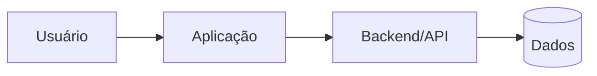

# ARCHITECTURE — Template

## Contexto
[Resumo técnico do sistema e ambiente]

## Escolhas principais
- frontend:
- backend:
- banco:
- autenticação:
- deploy:
- design system:
- Motion Profile: `ambient` por padrão (`none`, `subtle`, `ambient`, `expressive`):
- motion implementation: recursos nativos do design system / CSS / biblioteca especializada somente se necessário:
- testes:

Para cada escolha importante, registrar motivo curto e evitar tecnologia sem necessidade.

Interfaces devem seguir `ui/MOTION_POLICY.md`: motion é independente do design system, `prefers-reduced-motion` é obrigatório para movimento não essencial e telas densas/leitura prolongada podem atenuar `ambient` para comportamento `subtle`.

## Componentes

Adapte ou remova o diagrama quando não ajudar. Se não houver API formal, não rotule uma função interna como API apenas para preencher o desenho.

## Fluxo de dados
- ...

## Limites e contratos
- schema/dados:
- integrações:
- permissões:

### API, quando aplicável
- modo de governança: `none` / `lightweight` / `contract` / `governed`
- consumidores/owner:
- protocolo/estilo:
- fonte de verdade do contrato:
- caminho do contrato:
- compatibilidade/depreciação:
- gates de contrato/runtime:

Use `core/API_ENGINEERING.md`. Para API relevante/complexa, use também `API.md`; para interface pequena, mantenha apenas estas linhas. Não copie o contrato genérico da Factory para o projeto.

## Configuração por ambiente
Separar valores variáveis da lógica. Nunca registrar segredos.

## Segurança
- autenticação:
- autorização:
- dados sensíveis:
- secrets:
- privilégio mínimo:

Para APIs expostas, detalhes específicos ficam em `API.md`/contrato e seguem `core/API_ENGINEERING.md` + `skills/security-review`.

## Acessibilidade e movimento
- reduced motion:
- telas/fluxos onde `ambient` deve ser atenuado:
- sinais de atenção que precisam encerrar/reduzir após interação:

## Observabilidade
Definir apenas o necessário para diagnosticar falhas e comportamento.

## Recuperação
Em sistemas existentes ou mudanças de risco, registrar baseline, backup/migration e rollback adequados.

## Decisões substituídas
Não manter alternativas antigas como se ainda fossem vigentes. Referenciar decisão histórica quando necessário.