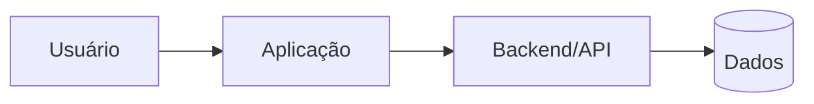

# ARCHITECTURE — Template

## Contexto
[Resumo técnico do sistema e ambiente]

## Escolhas principais
- frontend:
- backend:
- banco:
- autenticação:
- deploy:
- design system:
- Professional UI Profile: `professional-default` por padrão para UI material / exceção justificada:
- density: `compact` / `comfortable` / `spacious` quando relevante:
- surface: `flat` / `layered` / `immersive` quando relevante:
- emphasis: `quiet` / `balanced` / `bold` quando relevante:
- Motion Profile: `ambient` por padrão (`none`, `subtle`, `ambient`, `expressive`):
- Ambient Surface Profile: [não aplicável / `ambient-constellation`]:
- Constellation Intensity: [`strong` quando ativado]:
- constellation implementation: [SVG/pseudo-elements + CSS transform/opacity; Motion só quando necessário]:
- dense content strategy: [clean islands + constelação no shell/header/perímetro]:
- reduced motion constellation fallback: [estático / não aplicável]:
- motion implementation: recursos nativos do design system / CSS / biblioteca especializada somente se necessário:
- testes:
- semantic depth: [não aplicável / `scenario` / `domain` / `formal`]
- Independent Verification: `baseline` / `independent` / `adversarial` / `release`
- executor de verificação determinística: `github_ci` / self-hosted / local equivalente / não aplicável

Para cada escolha importante, registrar motivo curto e evitar tecnologia sem necessidade.

Interfaces devem seguir `ui/UI_POLICY.md`, `ui/PROFESSIONAL_UI_PROFILE.md`, `ui/MOTION_POLICY.md` e, quando ativo, `ui/AMBIENT_CONSTELLATION_PROFILE.md`:

- `professional-default` define o quality bar, não instala biblioteca;
- admin/dashboard/CRUD continua preferindo shadcn como base e ReUI seletivo quando não houver preferência explícita por HeroUI;
- escolha explícita de HeroUI para o sistema inteiro prevalece sobre o default administrativo e deve permanecer transversal;
- sistema novo HeroUI herda `ambient-constellation strong` automaticamente salvo exceção explícita/real;
- pedidos `ambient constellation`, `ambient constellarion`, `ambiente de constelação` e equivalentes ativam o mesmo perfil;
- constelação forte usa presença por composição/profundidade, não velocidade/strobe;
- tabelas/grids/forms densos ficam em superfícies limpas enquanto shell/header/perímetro preservam a assinatura;
- `prefers-reduced-motion` é obrigatório para movimento não essencial e a constelação deve ter fallback estático.

## Componentes

Adapte ou remova o diagrama quando não ajudar. Se não houver API formal, não rotule uma função interna como API apenas para preencher o desenho.

## Fluxo de dados
- ...

## Limites e contratos
- schema/dados:
- integrações:
- permissões:

### Semantic Assurance, quando `domain`/`formal`
- semantic contract: `specs/semantic-contract.json`
- semantic assurance: `specs/semantic-assurance.json`
- vocabulário/entidades/relações/estados que afetam arquitetura:
- restrições importantes:
- semantic diff/baseline:
- formalizações selecionadas: [não aplicável / kind + artefato + gate]

Use `core/SEMANTIC_ASSURANCE.md`. Não replique aqui o glossário/requisito inteiro.

### API, quando aplicável
- modo de governança: `none` / `lightweight` / `contract` / `governed`
- consumidores/owner:
- protocolo/estilo:
- fonte de verdade do contrato:
- caminho do contrato:
- compatibilidade/depreciação:
- gates de contrato/runtime:

Use `core/API_ENGINEERING.md`. Para API relevante/complexa, use também `API.md`.

### Independent Verification, quando acima de `baseline`
- modo: `independent` / `adversarial` / `release`
- checks `required`:
- checks `advisory`:
- ambiente/alvo efêmero:
- thresholds/budgets baseados em baseline real:
- exceções/suppressions:
- workflow/config autoritativo:

Use `core/INDEPENDENT_VERIFICATION.md` e detalhe a matriz em `VERIFICATION.md`.

## Configuração por ambiente
Separar valores variáveis da lógica. Nunca registrar segredos.

## Segurança
- autenticação:
- autorização:
- dados sensíveis:
- secrets:
- privilégio mínimo:

## UI profissional, quando aplicável
- inventário de arquétipos: shell / page-header / stats / search-command / filters / data-view / form / detail-inspector / feedback / outros realmente necessários:
- componentes reutilizados do design system/registry:
- componentes próprios justificados:
- estados críticos: loading / empty / error / success / disabled / permission denied / outros:
- estratégia mobile para dados densos:
- ação destrutiva/primary action:
- visual QA executado:

Não copiar templates/ativos proprietários de referências comerciais para a Factory ou projeto sem licença explícita aplicável.

## Ambient Constellation, quando ativo
- superfícies fortes selecionadas: shell / page-header / hero / dashboard overview / auth / empty-waiting / highlight / modal-drawer / AI / special cards:
- número de camadas animadas (default 2):
- períodos/direções não sincronizados:
- paleta/tokens usados:
- conteúdo denso isolado em superfície limpa:
- partículas decorativas `pointer-events: none` / fora da árvore acessível:
- animações limitadas a `transform`/`opacity` quando possível:
- blur/glow estático:
- mobile attenuation:
- offscreen/performance strategy quando material:

## Acessibilidade e movimento
- reduced motion:
- reduced transparency progressive enhancement:
- teclado/foco:
- telas/fluxos onde motion precisa ser atenuado:
- sinais de atenção que precisam encerrar/reduzir após interação:
- ausência de flash/strobe:
- axe-core/Playwright: [não aplicável / advisory / required conforme VERIFICATION.md]

## Observabilidade
Definir apenas o necessário para diagnosticar falhas e comportamento.

## Recuperação
Em sistemas existentes ou mudanças de risco, registrar baseline, backup/migration e rollback adequados.

## Decisões substituídas
Não manter alternativas antigas como se ainda fossem vigentes. Referenciar decisão histórica quando necessário.
